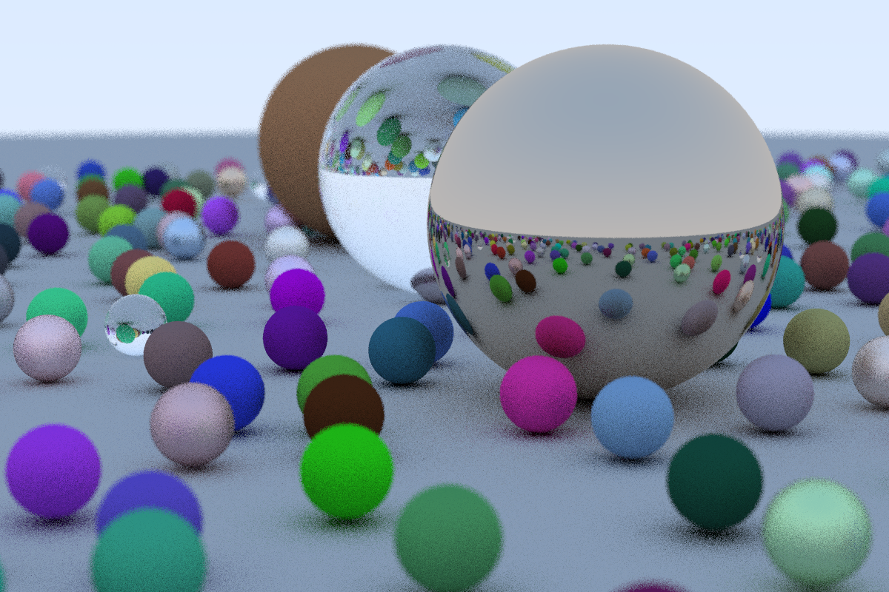

# raytracing_in_rust

Implementation of Raytracing in Rust from Peter Shirley's RTIW and RTTNW

Commits are done chapter by chapter
`Note: RTIW'sChapter 10 isn't missing, it was typo in commit message Chapter 11 is Chapter 10, Chapter 11 is Chapter 12`

Renders according to RTIW's chapter in [RTIW Chapter Renders](RTIWChapterRenders), RTTNW's chapter in [RTTNW Chapter Renders](RTNWChapterRenders),

Run it with `cargo run --release > output.ppm` command and .ppm image will be generated.

RTIW's Final output(Width = 1200, Height = 800, Sampling = 10)(Took ~3.5 mins to render using above command):
